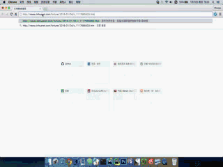
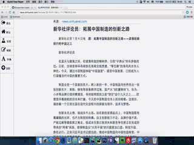

## Web-Clipper

Web-Clipper is a chrome extension that extract the main content of a news web page and display the news in a clean view. It is designed to improve user's online reading experience. As for none-news web page, it won't work.

Things sound a litter similar to  [Evernote](https://evernote.com/intl/zh-cn/sign-up/) and [Readability](https://www.readability.com/),both of which also can turn web page into a clean view. Yes! All of the three share the same belief: more focus,less distraction. But we can make it different. In addition to only content display, we can do a further job based on the content, such as emotion analysis,abstract extraction,keywords match,etc. A lot of interesting things can be done, so let's move on! :clap::clap::clap:

### ScreenShot
Below are demo screen shots at *xinhuanet.com* :smirk:

   
### Contributing
There are several things near the hand to deal.
- lack codes comments :scream::scream::scream:
- algorithm optimization :kissing_heart:
- code refactor to meet common pattern :wink:
- add new feature  :heart_eyes:
- ...

### WiKi
- [What algorithm is used in web-clipper ?](https://github.com/XfLoops/web-clipper/wiki/What-algorithm-is-used-in-web-clipper%3F)
- [Some tips on chrome extension develop.](https://github.com/XfLoops/web-clipper/wiki/Some-tips-on-chrome-extension-develop)
- 

### License
The MIT License (MIT)

> THE SOFTWARE IS PROVIDED “AS IS”, WITHOUT WARRANTY OF ANY KIND, EXPRESS OR IMPLIED, INCLUDING BUT NOT LIMITED TO THE WARRANTIES OF MERCHANTABILITY, FITNESS FOR A PARTICULAR PURPOSE AND NONINFRINGEMENT. IN NO EVENT SHALL THE AUTHORS OR COPYRIGHT HOLDERS BE LIABLE FOR ANY CLAIM, DAMAGES OR OTHER LIABILITY, WHETHER IN AN ACTION OF CONTRACT, TORT OR OTHERWISE, ARISING FROM, OUT OF OR IN CONNECTION WITH THE SOFTWARE OR THE USE OR OTHER DEALINGS IN THE SOFTWARE.

 Visit full MIT license: [http://mit-license.org/](http://mit-license.org/)
