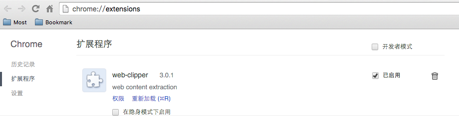

## Web-Clipper

Web-Clipper is a chrome extension that extract the main content of a news web page and display the news in a clean view. It is designed to improve user's online reading experience. As for none-news web page, it won't work.

Things sound a litter similar to  [Evernote](https://evernote.com/intl/zh-cn/sign-up/) and [Readability](https://www.readability.com/),both of which also can turn web page into a clean view. Yes! All of the three share the same belief: more focus,less distraction. But we can make it different. In addition to only content display, we can do a further job based on the content, such as emotion analysis,abstract extraction,keywords match,etc. A lot of interesting things can be done, so let's move on! :clap::clap::clap:

### ScreenShot
Below are demo screen shots at *xinhuanet.com* :smirk:

   

### Install
Download the web clipper and drag it to  chrome extension window to install it. [Download](https://github.com/XfLoops/web-clipper/blob/master/build/WebClipper_v3.0.1.crx)

### Not complete
There are several things near the hand to deal. However, any else improvements are also welcome. wanna open an [issue](https://github.com/XfLoops/web-clipper/issues/new) ? The TODOs include below ones:
- lack codes comments :scream::scream::scream:
- algorithm optimization :kissing_heart:
- code refactor to meet common pattern :wink:
- ...

### License
The MIT License

